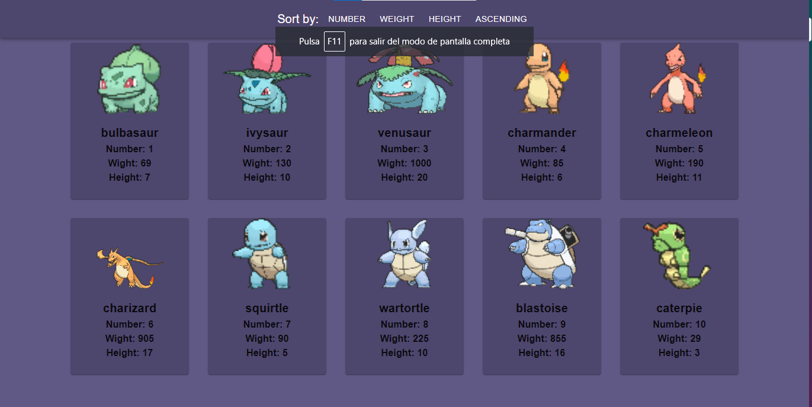

# Pokemon Web App

Este proyecto es una aplicación web simple escrita en React-Redux que consume la API de Pokémon (https://pokeapi.co/api/v2/). La aplicación muestra los primeros 10 Pokémon ordenados por peso, número y altura. También permite ordenar la lista de Pokémon y ver detalles específicos de cada Pokémon.

## Contenido

1. [Instalación](#instalación)
2. [Uso](#uso)
3. [Estructura del Proyecto](#estructura-del-proyecto)
4. [Tecnologías Utilizadas](#tecnologías-utilizadas)
5. [Capturas de Pantalla](#capturas-de-pantalla)
6. [Contribución](#contribución)
7. [Despliegue en Netlify](#despliegue-en-netlify)

## Instalación

Para instalar y ejecutar la aplicación, sigue estos pasos:

1. Clona este repositorio: `git clone https://github.com/tuusuario/pokemon-web-app.git`
2. Ingresa al directorio del proyecto: `cd pokemon-web-app`
3. Instala las dependencias: `npm install`
4. Inicia la aplicación: `npm start`

## Uso

Después de seguir los pasos de instalación, abre tu navegador y accede a [http://localhost:3000](http://localhost:3000). La aplicación te dirigirá automáticamente a la página de inicio. Desde allí, puedes navegar a la lista de Pokémon y ver detalles específicos de cada uno.

## Estructura del Proyecto

El proyecto sigue una estructura organizada:

- **src/components:** Contiene los componentes React.
- **src/redux:** Contiene archivos relacionados con Redux (acciones, reducer y store).
- **src/services:** Contiene servicios para realizar solicitudes a la API de Pokémon.
- **src/styles:** Contiene archivos de estilos.
- **public:** Contiene archivos estáticos.

## Tecnologías Utilizadas

- React
- Redux
- Material-UI
- React Router
- Axios

## Capturas de Pantalla

## Contribución

Si deseas contribuir al proyecto, sigue estos pasos:

1. Haz un fork del repositorio.
2. Crea una rama para tu contribución: `git checkout -b feature/nueva-funcionalidad`
3. Realiza tus cambios y haz commit: `git commit -m 'Añadir nueva funcionalidad'`
4. Haz push a tu rama: `git push origin feature/nueva-funcionalidad`
5. Abre un Pull Request.

## Despliegue en Netlify

La aplicación está desplegada en [Netlify](https://www.netlify.com/). Puedes acceder a ella en: [Enlace de Netlify]([https://pokemonapp-footalent.netlify.app/])
